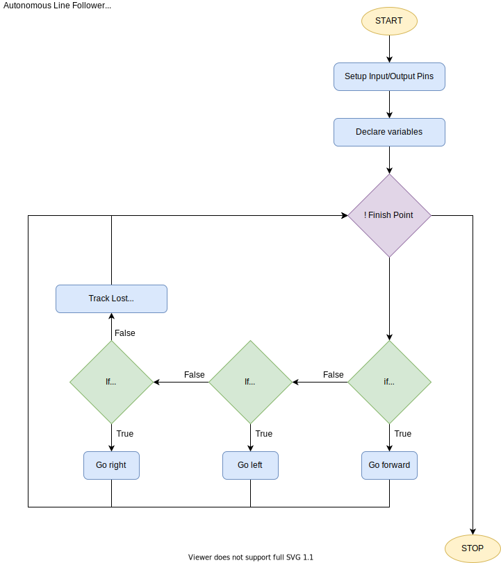

## Algorithm

The basic of line follower is input and output. Where form sensor and output to the motor driver. In between a fast and robust algorithm takes place to get a robust performance. We can use a wide range a programming language, but for the shake of simplicity we are using Arduino and AVR flavored C/C++ language.

> A raspberry powered line follower is more powerful and fast, as it has 2GHz speed with compare to Arduino which has 16MHz speed. You can use python as a programming language in raspberry

Another way to use parallel Arduino/AVR chips to increase performance.



A pseudo Arduino code:

```c
void setup() {
    pinMode(SENSOR[1], INPUT);
    pinMode(SENSOR[2], INPUT);
    pinMode(SENSOR[3], INPUT);

    pinMode(M1_CLOCK, OUTPUT);
    pinMode(M1_ANTI_CLOCK, OUTPUT);
    pinMode(M2_CLOCK, OUTPUT);
    pinMode(M2_ANTI_CLOCK, OUTPUT);

    analogWrite(SPEED_A, 50);
    analogWrite(SPEED_B, 50);  
}
void loop() {
    S1 = digitalRead(SENSOR[1]);
    S2 = digitalRead(SENSOR[2]);
    S3 = digitalRead(SENSOR[3]);

    if(S2 == IN_TRACK){
        motor.forward();
    }else if(S1 == IN_TRACK){
        motor.left();
    }else if(S3 == IN_TRACK){
        motor.right();
    }else{
        motor.stop();
    }
}
```